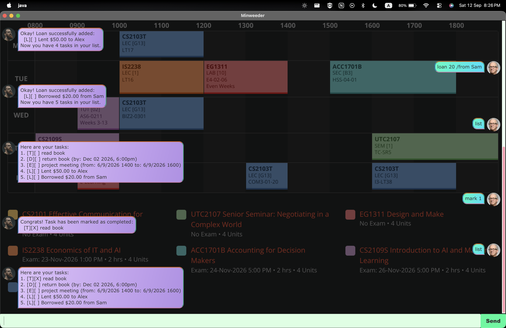

# Minweeder User Guide



Minweeder is a desktop app for tracking your tasks and loans, optimized for use via a
Command Line Interface (CLI) while still having the benefits of a Graphical User Interface (GUI).
If you can type fast, Minweeder can get your task management done faster than traditional
GUI apps.

## Quick start

1. Ensure you have Java 25 installed on your computer.
2. Download the latest `.jar` file for Minweeder.
3. Run the application, then type a command in the input box and press Enter to execute it.
   Some example commands you can try:
   - `list` : Lists all your tasks.
   - `todo read book` : Adds a todo task named `read book` to your list.
   - `deadline return book /by 2/12/2019 1800` : Adds a deadline task.
   - `bye` : Exits the app.
4. Refer to the [Features](#features) below for details of each command.

## Features

> **Notes on the command format**
> - Words in `UPPER_CASE` are parameters to be supplied by you.
>   e.g. in `todo DESCRIPTION`, `DESCRIPTION` is a parameter, which can be used as `todo read book`.
> - Extraneous parameters for commands that do not take in parameters (such as `list` and `bye`)
>   will be rejected.
> - Dates must be typed in the exact format shown in each command's example.

### Listing all tasks: `list`

Shows a list of all tasks currently in your list, numbered in the order they were added.

Example: `list`

```
Here are your tasks:
1. [T][ ] read book
2. [D][ ] return book (by: Dec 02 2019, 6:00PM)
```

### Adding a todo: `todo`

Adds a simple task with no associated date or time.

Example: `todo DESCRIPTION`

```
todo read book
```

```
Okay! Todo successfully added:
  [T][ ] read book
Now you have 1 tasks in your list.
```

### Adding deadlines: `deadline`

Adds a task that must be completed by a specific date and time.

Use `/by` to give the due date and time, in `d/M/yyyy HHmm` format (e.g. `2/12/2019 1800` for
2 December 2019, 6:00pm).

Example: `deadline DESCRIPTION /by d/M/yyyy HHmm`

```
deadline return book /by 2/12/2019 1800
```

```
Okay! Deadline successfully added:
  [D][ ] return book (by: Dec 02 2019, 6:00PM)
Now you have 2 tasks in your list.
```

### Adding events: `event`

Adds a task that spans a period of time, from a start point to an end point.

Use `/from` and `/to` to give the start and end of the event. These can be any text
(e.g. a day and time, or just a time), not only dates.

Example: `event DESCRIPTION /from START /to END`

```
event project meeting /from Mon 2pm /to 4pm
```

```
Okay! Event successfully added:
  [E][ ] project meeting (from: Mon 2pm to: 4pm)
Now you have 3 tasks in your list.
```

### Recording loans: `loan`

Keeps track of money lent to, or borrowed from, other people. Each loan is saved
like any other task, so it appears in `list`, can be `mark`ed/`unmark`ed once
settled, and can be `find`-ed by the other person's name.

Use `/to` when you gave money to someone, and `/from` when you received money
from them.

Example: `loan AMOUNT /to PERSON` or `loan AMOUNT /from PERSON`

```
loan 50 /to Alice
```

```
Okay! Loan successfully added:
  [L][ ] Lent $50.00 to Alice
Now you have 4 tasks in your list.
```

```
loan 20.50 /from Bob
```

```
Okay! Loan successfully added:
  [L][ ] Borrowed $20.50 from Bob
Now you have 5 tasks in your list.
```

### Marking a task as done: `mark`

Marks the specified task as completed, using its number from the `list` output.

Example: `mark INDEX`

```
mark 1
```

```
Congrats! Task has been marked as completed:
  [T][X] read book
```

### Marking a task as not done: `unmark`

Marks the specified task as not yet completed, using its number from the `list` output.

Example: `unmark INDEX`

```
unmark 1
```

```
Done! Task has been marked as not done yet:
  [T][ ] read book
```

### Deleting a task: `delete`

Removes the specified task from your list, using its number from the `list` output.

Example: `delete INDEX`

```
delete 2
```

```
Task successfully removed: 
 [D][ ] return book (by: Dec 02 2019, 6:00PM)
Now you have 4 tasks in your list.
```

### Finding tasks by keyword: `find`

Finds tasks whose description contains the given keyword. Task numbers shown match
their position in the full `list`, so they can be used directly with `mark`, `unmark`,
or `delete`.

Example: `find KEYWORD`

```
find book
```

```
Here are the matching tasks in your list:
1. [T][ ] read book
```

### Finding tasks on a date: `on`

Shows all deadline and event tasks occurring on the given date.

Example: `on d/M/yyyy`

```
on 2/12/2019
```

```
Tasks occurring on Dec 02 2019:
2. [D][ ] return book (by: Dec 02 2019, 6:00PM)
```

### Exiting the program: `bye`

Exits the application.

Example: `bye`

### Saving the data

Minweeder data is saved automatically to disk after every command that changes the list.
There is no need to save manually.

## Command summary

| Action | Format | Example |
|---|---|---|
| List | `list` | `list` |
| Todo | `todo DESCRIPTION` | `todo read book` |
| Deadline | `deadline DESCRIPTION /by d/M/yyyy HHmm` | `deadline return book /by 2/12/2019 1800` |
| Event | `event DESCRIPTION /from START /to END` | `event project meeting /from Mon 2pm /to 4pm` |
| Loan | `loan AMOUNT /to PERSON` or `loan AMOUNT /from PERSON` | `loan 50 /to Alice` |
| Mark | `mark INDEX` | `mark 1` |
| Unmark | `unmark INDEX` | `unmark 1` |
| Delete | `delete INDEX` | `delete 2` |
| Find | `find KEYWORD` | `find book` |
| On | `on d/M/yyyy` | `on 2/12/2019` |
| Bye | `bye` | `bye` |
